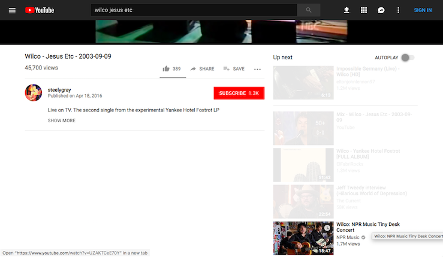

# CSS style sheet for a friendly/boring YouTube experience

Simple CSS style sheet to make some changes to YouTube:
* Hide the comments section
* Fade the sidebar items & un-fade when hovering over individual items
* Hide the thumbs down icon & count

**Inspired by [shutup.css by panicsteve](https://github.com/panicsteve/shutup-css)**

Youtube with the style sheet active:

End :)
